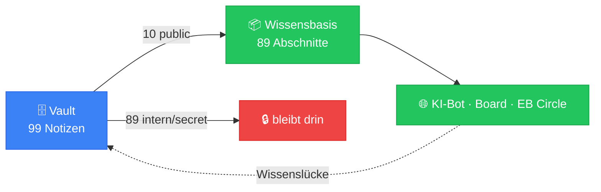

# ⚡ Impuls-Strom — der lebende Zustand

> **Automatisch erzeugt** von `scripts/pulse.mjs` · Stand: **2026-08-15**
> Nicht von Hand bearbeiten — jeder Lauf überschreibt die Datei.
> Diese Notiz misst, was im Netz tatsächlich fließt. Die Ströme selbst
> sind in [[00-Kern/Wissensstroeme]] beschrieben.

## 🧠 Schichtung des Brains

| Ebene | Notizen | Verteilung |
|-------|---------|------------|
| **L0** | 10 | `████████··············` |
| **L1** | 21 | `█████████████████·····` |
| **L2** | 28 | `██████████████████████` |
| **L3** | 13 | `██████████············` |
| **L4** | 14 | `███████████···········` |
| **L5** | 13 | `██████████············` |

**Gesamt: 99 Notizen**

## 🔒 Freigabe-Bilanz (Impuls 5 + L4-Veto)

| Klasse | Notizen | Bedeutung |
|--------|---------|-----------|
| 🟢 `public` | **10** | fließt zur Website-KI |
| 🟡 `internal` | 79 | bleibt im Vault |
| 🔴 `secret` | 10 | verlässt den Vault nie |
| ⚠️ fehlt | 0 | keine — sauber |



## 📚 Was die Website-KI weiß

- **89 Abschnitte** aus **10 Notizen**
- Themen: `Buchung & Zahlung` · `Event-Planung in der Praxis` · `Gebühren & Provision` · `Inserate erstellen & verwalten` · `Konto & Anmeldung` · `Nachrichten & Kontakt` · `Planungs-Board nutzen` · `Sicherheit & Vertrauen` · `Suchen & Dienstleister finden` · `Über Eventbörse`
- Quellordner: 10-Produkt/Wissen

## 🎉 Event-Abdeckung

**30 Event-Typen** in **7 Gruppen** — von der Hochzeit
bis zum Tabletop-Abend. Die Vision „jede Art von Event" misst sich hier.

## 🔁 Bewegung im Code

| Kennzahl | Wert |
|----------|------|
| Commits (7 Tage) | **30** |
| Commits (30 Tage) | 128 |
| Letzter Commit | `71a6ebd · Merge pull request #155 from Sabindro53/agent/add-ai-transparency` (2026-08-14) |

**Meistbewegte Dateien (30 Tage):**
```
38 app.js
  37 tests/e2e/kern.spec.js
  33 CLAUDE.md
  30 vault/50-Evolution/Roadmap/Current-Sprint.md
  28 styles.css
```

**Codegröße:**
- `app.js` — 26.532 Zeilen
- `styles.css` — 17.065 Zeilen
- `functions.php` — 10.209 Zeilen
- `app-shell.html` — 4.122 Zeilen

## Verwandt
- [[00-Kern/Wissensstroeme]] — die sechs Impulse
- [[00-Kern/Synergie-Pipeline]] — der Weg zur Website
- [[00-Kern/Sicherheits-Klassifikation]] — warum 10 Notizen nie hinausgehen
- [[00-Kern/Neural-Map]] — dasselbe Netz visuell
