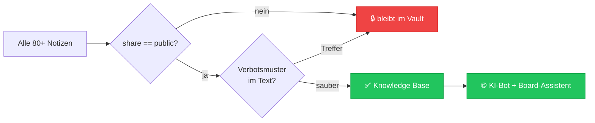

# Sicherheits-Klassifikation — Was darf nach außen?

> Die Website-KI ist nur so sicher wie die Grenze, die sie nicht überschreiten kann.
> Diese Grenze ist **ein Feld im Frontmatter**: `share`.
> Sie wird nicht diskutiert, sie wird **gebaut** — der Export kennt nur `public`.

## Die drei Klassen

| Klasse | Bedeutung | Verlässt den Vault? | Beispiele |
|--------|-----------|---------------------|-----------|
| 🟢 `public` | Für Nutzer gedacht. Erklärt Bedienung, Ablauf, Begriffe. | **Ja** → Knowledge Base der Website | Features, UserFlows, Glossar |
| 🟡 `internal` | Team-/Bauwissen. Korrekt, aber nicht nutzerrelevant. | Nein | Architektur, APIs, Betrieb, Roadmap |
| 🔴 `secret` | Schutzwissen. Preisgabe erhöht Angriffsfläche. | **Niemals** | Security-Hardening, Rate-Limits, Permissions, Webhooks |

## Der Filter ist eine Whitelist, keine Blacklist



**Zwei Schlösser statt einem:**
1. **Whitelist:** Nur `share: public` wird überhaupt betrachtet. Vergisst jemand das Feld,
   ist die Notiz automatisch **nicht** öffentlich (Fail-Safe: kein Feld = nicht public).
2. **Inhaltsscan:** Auch eine `public`-Notiz wird verworfen bzw. bereinigt, wenn sie
   Verbotsmuster enthält.

## Verbotsmuster (harte Ausschlusskriterien)

Der Build bricht die Aufnahme ab, wenn im Text auftaucht:

- Zugangsdaten: `password`, `passwort:`, `secret`, `token`, `api_key`, `apikey`, `bearer `
- Schlüssel: `sk_live`, `sk_test`, `pk_live`, `-----BEGIN`, `PRIVATE KEY`
- Infrastruktur: konkrete Hostnamen, IP-Adressen, SFTP-/DB-Zugänge, `wp-config`
- Personendaten: E-Mail-Adressen, Telefonnummern, Klarnamen von Nutzern
- Angriffsfläche: exakte Rate-Limit-Schwellen, Nonce-/Session-Interna, Webhook-Signaturlogik

> **Grundsatz:** Im Zweifel `internal`. Eine fehlende Bot-Antwort ist ein Komfortproblem,
> eine geleakte Interna ist ein Sicherheitsvorfall.

## Warum ganze Ordner `secret` sind

`40-Governance/Security/` beschreibt **Abwehrmechanismen**. Wer sie kennt, kann sie umgehen.
Diese Notizen sind für Claude und dich wertvoll — für einen anonymen Chat-Nutzer sind sie
ausschließlich Risiko. Deshalb: **kein Security-Wissen in der Knowledge Base**, auch nicht
umformuliert.

Die Website-KI darf sagen: *„Deine Zahlung läuft über Stripe, Eventbörse sieht deine Bankdaten nie."*
Sie darf **nicht** sagen, wie Webhook-Signaturen geprüft oder Rate-Limits gestaffelt sind.

## Prüfen, was aktuell freigegeben ist

```bash
# Welche Notizen sind public?
grep -rl '^share: public' vault --include='*.md'

# Was landet tatsächlich in der Knowledge Base?
node scripts/build-knowledge.mjs --report
```

Der Build gibt bei jedem Lauf eine **Freigabe-Bilanz** aus (aufgenommen / abgelehnt / Grund).
Diese Bilanz ist das Audit-Protokoll — sie gehört bei Zweifeln in den PR.

## Review-Pflicht

Eine Notiz von `internal` auf `public` zu heben ist eine **Sicherheitsentscheidung**.
Sie gehört in einen eigenen Commit mit Begründung — nie beiläufig in einem Feature-Commit.

## Verwandt
- [[00-Kern/Synergie-Pipeline]] — der technische Weg nach draußen
- [[00-Kern/Wissensstroeme]] — Impuls 5 (Freigabe) und das L4-Veto
- [[40-Governance/Security/Permissions]] · [[20-System/Architecture/Security-Model]]
