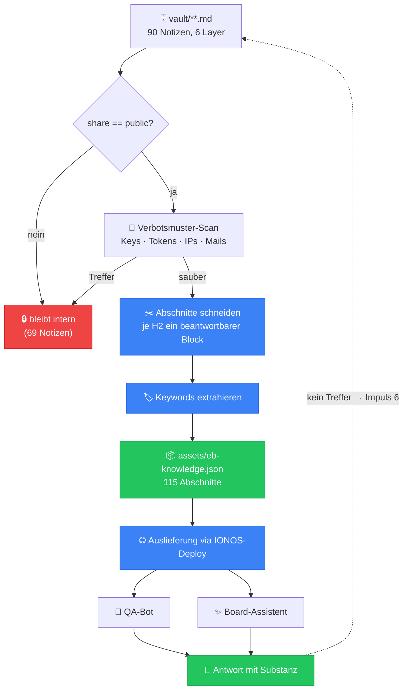

# Synergie-Pipeline — Brain → Claude → Website

> Die Vision in einem Satz: **Was wir einmal wissen, weiß danach auch die Seite.**
> Diese Notiz beschreibt den einzigen technischen Weg, auf dem Vault-Wissen
> zur Website-KI wird — nachvollziehbar, gefiltert, wiederholbar.

## Der Weg



## Die drei Beteiligten

| Rolle | Aufgabe | Grenze |
|-------|---------|--------|
| **Brain** (Vault) | Hält das Wissen strukturiert und klassifiziert | Kennt keinen Code-Zustand — nur was dokumentiert wurde |
| **Claude** | Übersetzt Absicht in Code **und** pflegt das Brain | Liest zu Session-Beginn L5, schreibt nach jeder Änderung zurück |
| **Website** | Beantwortet Nutzerfragen aus dem freigegebenen Teil | Sieht ausschließlich `share: public` |

Die Synergie entsteht, weil **alle drei dieselbe Quelle** haben. Ohne Brain wäre Claude
bei jeder Session vergesslich und die Website hätte nur hartcodierte Phrasen.

## Der Befehl

```bash
node scripts/build-knowledge.mjs            # Wissensbasis bauen
node scripts/build-knowledge.mjs --report   # + Freigabe-Bilanz (Audit)
node scripts/build-knowledge.mjs --check    # nur prüfen, schreibt nichts (CI)
```

Ausgabe: `assets/eb-knowledge.json` — eine statische Datei, die mit dem Theme
ausgeliefert wird. Kein Server, keine Datenbank, keine externe KI.

## Wie die Seite damit antwortet

Beide Bots nutzen dieselbe Retrieval-Funktion in `app.js`:

1. `_ebKbLoad()` — lädt die JSON einmalig beim Öffnen des Bots (still, im Hintergrund).
2. `_ebKbSearch(frage)` — bewertet jeden Abschnitt: Treffer in der Überschrift zählen am
   stärksten, dann Schlüsselwörter, dann Volltext; deutsche Komposita werden über
   Wortstämme abgefangen („Zahlungsdaten" findet „Zahlung").
3. `_ebKbGoodHit()` — nur ein ausreichend klarer Treffer wird als Antwort ausgespielt.
   Sonst greift die bisherige Intent-Logik bzw. der ehrliche Fallback.

**Wichtig:** Die Wissensbasis **ersetzt** die bestehenden Intents nicht, sie **ergänzt** sie.
Navigationsfragen („bring mich zum Board") beantwortet weiterhin die Intent-Schicht mit
Aktions-Buttons; Inhaltsfragen („wann wird ausgezahlt?") jetzt die Wissensbasis.

## Impuls 6 — Das Netz lernt

Findet kein Bot eine Antwort, wird die Frage lokal als **Wissenslücke** vermerkt
(`localStorage: eb_kb_misses`). Diese Liste ist Rohmaterial für neue `share: public`-Notizen.

```js
JSON.parse(localStorage.getItem('eb_kb_misses') || '[]')
```

So wächst die Abdeckung entlang echter Nutzerfragen statt entlang von Vermutungen.

## Wann neu bauen?

| Auslöser | Aktion |
|----------|--------|
| Neue/geänderte `share: public`-Notiz | `node scripts/build-knowledge.mjs` + committen |
| Notiz von `internal` → `public` gehoben | Erst Review, dann Build, eigener Commit |
| Vor jedem Release | `--report` laufen lassen und Bilanz prüfen |

## Verwandt
- [[00-Kern/Wissensstroeme]] — die sechs Impulse
- [[00-Kern/Sicherheits-Klassifikation]] — warum der Filter eine Whitelist ist
- [[00-Kern/Neural-Map]] — die Sicherheits-Sicht im Graphen
- [[30-Betrieb/CI-CD/Deployment]] — wie die Datei live geht
