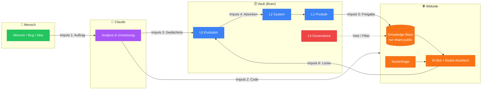
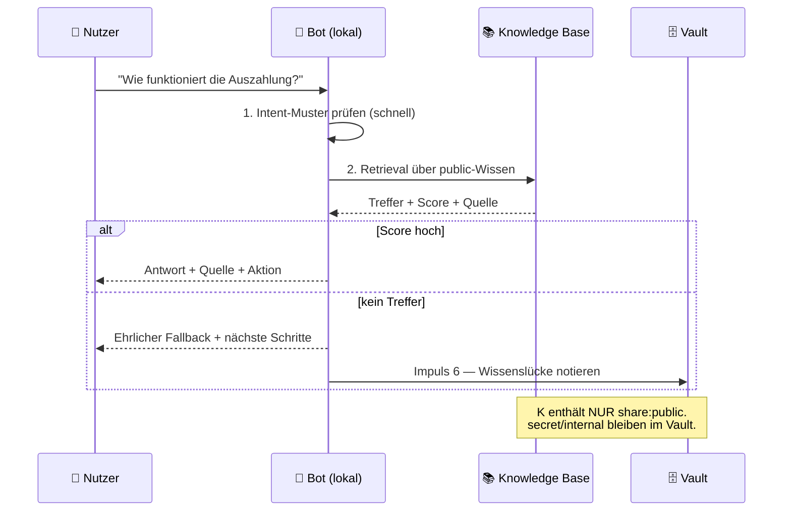

# Wissensströme — Die Impulse im Netz

> Ein Brain ist nicht die Summe seiner Notizen, sondern die Summe seiner **Ströme**.
> Hier sind die sechs Impulse, die zwischen Mensch, Claude, Vault und Website fließen.
> Jeder Impuls hat eine Richtung, einen Auslöser und ein Ziel.

## Übersicht: Der Kreislauf

## Die sechs Impulse im Detail

### ⚡ Impuls 1 — Auftrag (Mensch → Claude)
**Auslöser:** Du schreibst einen Wunsch, meldest einen Bug, schickst einen Screenshot.
**Wirkung:** Claude liest zuerst `L5 · Current-Sprint` + `L5 · Claude-Kontext`, versteht den Stand
und arbeitet nicht gegen frühere Entscheidungen.
**Nicht-Ziel:** Kein Impuls startet direkt in L2 — Kontext kommt immer zuerst.

### ⚡ Impuls 2 — Code (Claude → Website)
**Auslöser:** Umsetzung ist verifiziert.
**Wirkung:** Push auf `main` → GitHub Actions → IONOS. Siehe [[30-Betrieb/CI-CD/Deployment]].
**Kontrolle:** Kein Deploy ohne grünen Run.

### ⚡ Impuls 3 — Gedächtnis (Claude → L5)
**Auslöser:** Nach jeder relevanten Änderung.
**Wirkung:** `Current-Sprint` und `Claude-Kontext` werden fortgeschrieben.
So beginnt die nächste Session nicht bei null — **das ist die eigentliche Synergie.**

### ⚡ Impuls 4 — Absinken (L5 → L2/L1)
**Auslöser:** Ein Sprint-Thema ist stabil geworden.
**Wirkung:** Aus „gerade gebaut" wird „so ist es gebaut" — die Notiz wandert von Evolution
in System/Produkt. Verhindert, dass L5 zur Müllhalde wird.

### ⚡ Impuls 5 — Freigabe (L1 → Knowledge Base → Website)
**Auslöser:** Build-Schritt `scripts/build-knowledge.mjs`.
**Wirkung:** **Nur** Notizen mit `share: public` werden zu `assets/eb-knowledge.json` verdichtet
und von KI-Bot & Board-Assistent beantwortet.
**Veto:** L4 · Governance filtert mit — `share: secret` verlässt den Vault nie.
Details: [[00-Kern/Synergie-Pipeline]].

### ⚡ Impuls 6 — Lücke (Website → L5)
**Auslöser:** Der Bot findet keine gute Antwort (Fallback-Treffer).
**Wirkung:** Die Frage ist ein Signal: hier fehlt Wissen. Sie gehört als Notiz nach
`L5 · Feature-Ideen` bzw. als neue `share: public`-Notiz nach L1.
**So schließt sich der Kreis** — das Netz lernt aus dem, was es nicht wusste.

## Abfrage-Strom: Was passiert bei einer Nutzerfrage?

## Warum das kein Deko-Diagramm ist

Jeder Impuls hat eine echte Entsprechung im Repo:

| Impuls | Technische Entsprechung |
|--------|-------------------------|
| 1 | `CLAUDE.md` → Vault-Lesepflicht zu Session-Beginn |
| 2 | `.github/workflows/ionos-deploy.yml` |
| 3 | `50-Evolution/AI-Gedaechtnis/Claude-Kontext.md` |
| 4 | Layer-Regeln in [[00-Kern/Layer-Modell]] |
| 5 | `scripts/build-knowledge.mjs` → `assets/eb-knowledge.json` |
| 6 | Fallback-Logging im Bot (`_ebKbMiss`) |

## Verwandt
- [[00-Kern/Neural-Map]] · [[00-Kern/Layer-Modell]] · [[00-Kern/Synergie-Pipeline]] · [[00-Kern/Sicherheits-Klassifikation]]
