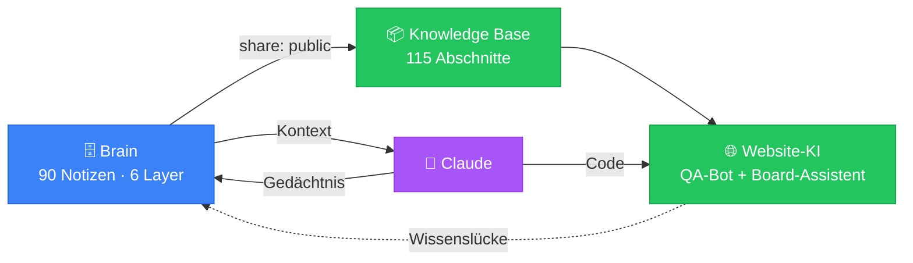

# 🧠 Eventbörse — Brain

> **Ziel:** Die beste und funktionalste Eventplattform für jedermann
> **Stack:** WordPress (API) + Vanilla JS SPA · **Stand:** 2026-07-24
> **Neu hier?** → [[00-Kern/Onboarding]] · **Netz verstehen?** → [[00-Kern/Neural-Map]]

Dieses Brain ist in **sechs Ebenen** geschichtet. Jede Notiz kennt ihre Ebene und ihre
Freigabestufe — daraus entstehen die Farben im Graphen und die Grenze zur Website-KI.

---

## 🗺️ Die sechs Ebenen

| | Ebene | Worum es geht | Einstieg |
|---|-------|---------------|----------|
| ⚪️ | **L0 · Kern** | Wissen über das Wissen | [[00-Kern/Layer-Modell]] · [[00-Kern/Neural-Map]] · [[00-Kern/Wissensstroeme]] |
| 🟢 | **L1 · Produkt** | Was Nutzer erleben | [[10-Produkt/Features/Listings]] · [[10-Produkt/Wissen/Ueber-Eventboerse]] |
| 🔵 | **L2 · System** | Wie es gebaut ist | [[20-System/Architecture/Overview]] · [[20-System/Frontend/app-js-module]] |
| 🟣 | **L3 · Betrieb** | Wie es läuft | [[30-Betrieb/CI-CD/Deployment]] · [[30-Betrieb/Operations/Runbooks]] |
| 🔴 | **L4 · Governance** | Was gilt | [[40-Governance/Security/Permissions]] · [[40-Governance/Legal/Compliance-Overview]] |
| 🟠 | **L5 · Evolution** | Wohin es geht | [[50-Evolution/Roadmap/Current-Sprint]] · [[50-Evolution/AI-Gedaechtnis/Claude-Kontext]] |

## ⚡ Die Synergie



**Wie das konkret funktioniert:** [[00-Kern/Synergie-Pipeline]] ·
**Was nach außen darf:** [[00-Kern/Sicherheits-Klassifikation]]

```bash
node scripts/build-knowledge.mjs --report   # Wissensbasis bauen + Freigabe-Bilanz
```

---

## 🚀 Täglicher Einstieg

1. [[50-Evolution/Roadmap/Current-Sprint]] — was gerade gebaut wird
2. [[50-Evolution/AI-Gedaechtnis/Claude-Kontext]] — Projekt-Gedächtnis & Präferenzen
3. [[50-Evolution/AI-Gedaechtnis/Code-Beziehungen]] — Modul-Abhängigkeiten
4. [[50-Evolution/Roadmap/Bekannte-Bugs]] — offene Baustellen

## 🟢 L1 · Produkt

**Features:** [[10-Produkt/Features/Authentication|Authentifizierung]] ·
[[10-Produkt/Features/Listings|Listings & Suche]] ·
[[10-Produkt/Features/Messaging|Chat]] ·
[[10-Produkt/Features/Payments|Zahlungen]] ·
[[10-Produkt/Features/Planungsboard|Planungs-Board]] ·
[[10-Produkt/Features/Reviews|Bewertungen]] ·
[[10-Produkt/Features/Admin|Admin]]

**User-Flows:** [[10-Produkt/UserFlows/Registrierung-und-Login|Registrierung & Login]] ·
[[10-Produkt/UserFlows/Suche-und-Entdeckung|Suche & Entdeckung]] ·
[[10-Produkt/UserFlows/Event-Planer-Bucht-DJ|Planer bucht DJ]] ·
[[10-Produkt/UserFlows/Dienstleister-Erstellt-Listing|Dienstleister inseriert]]

**Öffentliches Wissen** (🟢 speist die Website-KI):
[[10-Produkt/Wissen/Ueber-Eventboerse|Über Eventbörse]] ·
[[10-Produkt/Wissen/Konto-und-Anmeldung|Konto & Anmeldung]] ·
[[10-Produkt/Wissen/Suchen-und-Finden|Suchen & Finden]] ·
[[10-Produkt/Wissen/Inserate-erstellen|Inserate erstellen]] ·
[[10-Produkt/Wissen/Buchung-und-Zahlung|Buchung & Zahlung]] ·
[[10-Produkt/Wissen/Planungsboard-nutzen|Board nutzen]] ·
[[10-Produkt/Wissen/Nachrichten-und-Kontakt|Nachrichten]] ·
[[10-Produkt/Wissen/Sicherheit-und-Vertrauen|Sicherheit & Vertrauen]] ·
[[10-Produkt/Wissen/Event-Planung-Praxis|Planung in der Praxis]]

## 🔵 L2 · System

**Architektur:** [[20-System/Architecture/Overview|Übersicht]] ·
[[20-System/Architecture/Tech-Stack|Tech-Stack]] ·
[[20-System/Architecture/Datenmodell|Datenmodell]] ·
[[20-System/Architecture/Security-Model|Security-Model]] ·
[[20-System/Architecture/Performance|Performance]] ·
[[20-System/Architecture/Frontend-Routing|Routing]]

**Frontend:** [[20-System/Frontend/app-js-module|app.js Module]] ·
[[20-System/Frontend/UI-Patterns|UI-Patterns]] ·
[[20-System/Frontend/State-Management|State]] ·
[[20-System/Frontend/Avatar-System|Avatare]] ·
[[20-System/Frontend/Loading-Overlay|Loading]]

**Backend:** [[20-System/Backend/API-Endpoints|API-Übersicht]] ·
[[20-System/Backend/Auth-API|Auth]] ·
[[20-System/Backend/Listings-API|Listings]] ·
[[20-System/Backend/Messaging-API|Messaging]] ·
[[20-System/Backend/Payment-API|Payment]] ·
[[20-System/Backend/Board-API|Board]] ·
[[20-System/Backend/Admin-API|Admin]] ·
[[20-System/Backend/WebAuthn-API|WebAuthn]] ·
[[20-System/Backend/Reviews-API|Reviews]] ·
[[20-System/Backend/Favorites-API|Favoriten]] ·
[[20-System/Backend/Upload-Handler|Uploads]]

**Komponenten:** [[20-System/Komponenten/NavBar|NavBar]] ·
[[20-System/Komponenten/ListingCard|ListingCard]] ·
[[20-System/Komponenten/ChatModal|ChatModal]] ·
[[20-System/Komponenten/Board-Kanban|Board-Kanban]] ·
[[20-System/Komponenten/DetailGalerie|Detail-Galerie]] ·
[[20-System/Komponenten/HeroMarquee|Hero-Marquee]]

## 🟣 L3 · Betrieb

[[30-Betrieb/CI-CD/Deployment|Deployment]] ·
[[30-Betrieb/Testing|Testing & QA]] ·
[[30-Betrieb/Operations/Monitoring|Monitoring]] ·
[[30-Betrieb/Operations/Runbooks|Runbooks]] ·
[[30-Betrieb/Operations/Incident-Response|Incident-Response]] ·
[[30-Betrieb/Operations/Backup-Restore|Backup & Restore]]

**Integrationen:** [[30-Betrieb/Integrationen/Stripe|Stripe]] ·
[[30-Betrieb/Integrationen/SMTP|SMTP]] ·
[[30-Betrieb/Integrationen/Leaflet|Leaflet]] ·
[[30-Betrieb/Integrationen/DiceBear|DiceBear]] ·
[[30-Betrieb/Integrationen/GitHub-Actions|GitHub Actions]]

## 🔴 L4 · Governance

**Security** (🔒 `secret` — verlässt den Vault nie):
[[40-Governance/Security/Permissions|Permissions]] ·
[[40-Governance/Security/Rate-Limit|Rate-Limit]] ·
[[40-Governance/Security/EBSafeHTML|EBSafeHTML]] ·
[[40-Governance/Security/EBSession|EBSession]] ·
[[40-Governance/Security/CSP-Headers|CSP]] ·
[[40-Governance/Security/Upload-Hardening|Upload-Hardening]] ·
[[40-Governance/Security/Stripe-Webhook|Stripe-Webhook]] ·
[[40-Governance/Security/Cache-Strategy|Cache]] ·
[[40-Governance/Security/2026-05-02-Security-Hardening|Hardening 05/2026]]

**Recht:** [[40-Governance/Legal/Compliance-Overview|Compliance]] ·
[[40-Governance/Legal/Cookie-Liste|Cookies]] ·
[[40-Governance/Legal/Loeschkonzept|Löschkonzept]] ·
[[40-Governance/Legal/Auftragsverarbeiter|Auftragsverarbeiter]]

## 🟠 L5 · Evolution

[[50-Evolution/Roadmap/Current-Sprint|Current Sprint]] ·
[[50-Evolution/Roadmap/Feature-Ideen|Feature-Ideen]] ·
[[50-Evolution/Roadmap/Bekannte-Bugs|Bekannte Bugs]] ·
[[50-Evolution/Roadmap/App-Store-Readiness|App-Store-Readiness]] ·
[[50-Evolution/Roadmap/Search-Improvement-Patch|Such-Patch]]

**Gedächtnis:** [[50-Evolution/AI-Gedaechtnis/Claude-Kontext|Claude-Kontext]] ·
[[50-Evolution/AI-Gedaechtnis/Code-Beziehungen|Code-Beziehungen]] ·
[[50-Evolution/AI-Gedaechtnis/Entscheidungen|Entscheidungen]] ·
[[50-Evolution/AI-Gedaechtnis/Code-Stats|Code-Stats]]

**Archiv** (nicht mehr pflegen): [[50-Evolution/Archiv/Latest-Stand-2026-06-06|Snapshot 06/2026]] ·
[[50-Evolution/Archiv/Latest-Stand-2026-05-22|Snapshot 05/2026]] ·
[[50-Evolution/Archiv/KI-Office-Offline-Betrieb|KI-Office-Log]]

## 🔎 Nachschlagen

[[00-Kern/Glossar|Glossar]] — Begriffe & Anonymisierungs-Konventionen

---

## 📐 Regeln für neue Notizen

1. **Frontmatter zuerst** — `layer`, `domain`, `share`, `tags`. Ohne `share: public` bleibt
   die Notiz intern (Fail-Safe).
2. **Mindestens ein Link** auf eine bestehende Notiz — sonst wird sie zur Waise im Graphen.
3. **Ebene nach Frage wählen**, nicht nach Gefühl: *Was?* → L1, *Wie gebaut?* → L2,
   *Wie betrieben?* → L3, *Erlaubt?* → L4, *Als nächstes?* → L5.
4. **Im Zweifel `internal`.** Freigabe nach `public` ist eine Sicherheitsentscheidung
   mit eigenem Commit → [[00-Kern/Sicherheits-Klassifikation]].
5. Nach `public`-Änderungen: `node scripts/build-knowledge.mjs` und die JSON mitcommitten.

---

## 📊 Code-Statistiken

```
app.js         23.300 Zeilen  (SPA Frontend)
functions.php   7.717 Zeilen  (WordPress Backend, 84 REST-Routen)
styles.css     16.400 Zeilen  (Alle Styles)
app-shell.html  3.957 Zeilen  (SPA-Body, einzige Quelle)
index.php         208 Zeilen  (WP-Template: Head + readfile(app-shell))
```

*Zuletzt aktualisiert: 2026-07-24*
