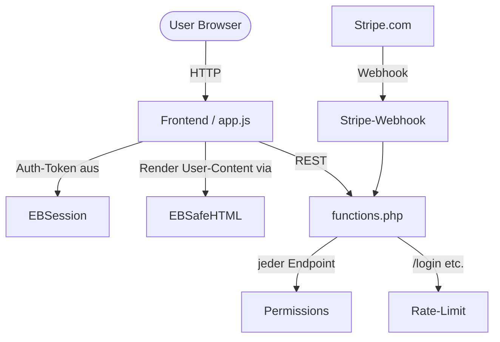

# Security-Hardening 2026-05-02

Index aller Sicherheits-Module die in dieser Session live gegangen sind. Ausloeser: [[Claude-Auto-Audit 2026-05-02|Audit Issue #13]] mit 5 P0-Funden, alle gefixt als isolierte Drop-in-Module.

## Live auf main

| P0 | Modul | Note | PR | Datei |
|----|-------|------|----|-------|
| 0.1 | Permission-Callbacks | [[Permissions]] | #20 | `includes/security/permissions.php` |
| 0.2 | XSS-Schutz | [[EBSafeHTML]] | #19 | `assets/js/security/sanitize.js` |
| 0.3 | Stripe-Webhook | [[Stripe-Webhook]] | #16 | `includes/security/stripe-webhook.php` |
| 0.4 | Auth Rate-Limit | [[Rate-Limit]] | #18 | `includes/security/rate-limit.php` |
| 0.5 | Token-Expiry | [[EBSession]] | #17 | `assets/js/security/session.js` |

## Wie das alles zusammenhaengt

## Was war der Audit-Befund

Alle Befunde stammen aus dem nightly [[Claude-Auto-Audit 2026-05-02|Audit-Run vom 02.05.]]:

1. **REST-Endpoints ohne Auth-Check** — bei ~67 Routes in [[functions.php]] unklar ob `permission_callback` gesetzt → potenziell oeffentliche Mutationen
2. **XSS via `innerHTML`** — User-Inhalte (Listing-Beschreibung, Chat, Reviews) wurden ungefiltert ins DOM gerendert
3. **Stripe ohne Signaturverifikation** — Webhook-Endpoint hat Zahlungsstatus ohne HMAC-Check geaendert
4. **Brute-Force ungeschuetzt** — Login/Register/Reset ohne Rate-Limit
5. **Sessions unbegrenzt** — Auth-Token in `localStorage` ohne Ablaufdatum

## Was noch zu tun ist

Die Module sind installiert, aber **nicht automatisch in der App verdrahtet** — bewusste Entscheidung gegen Big-Bang. Migrations-Schritte stehen jeweils im PR-Body. Die Reihenfolge laut [[App-Store-Readiness|Roadmap]] ist:

1. `require_once` der drei PHP-Module in [[functions.php]]
2. `<script>`-Tags fuer die zwei JS-Module vor `app.js`
3. Schrittweise Migration der bestehenden Code-Stellen pro Modul
4. WP_DEBUG fuer 1 Tag → Audit-Logger findet alle ungeschuetzten Routes
5. Phase 2 starten: PWA-Foundation

## Verwandte Notes

[[Authentication]] · [[Payments]] · [[API-Endpoints]] · [[Code-Beziehungen]] · [[App-Store-Readiness]] · [[Dashboard]]
